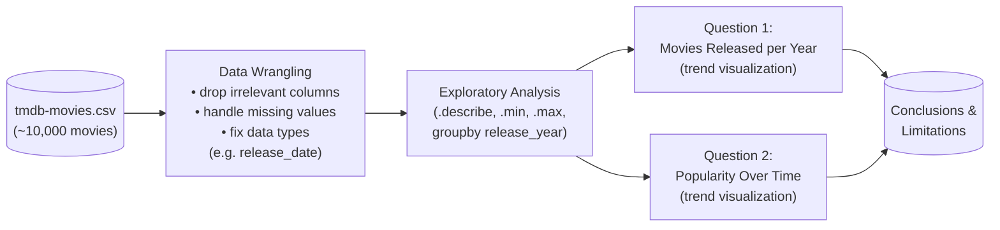

# Investigating a Dataset — TMDb Movie Trends

An exploratory data analysis (EDA) project examining ~10,000 movies from The Movie Database (TMDb) to understand how movie output and popularity have changed over time.

> **Note:** This project was completed as part of Udacity Data Analyst coursework (used to fulfill a WGU course requirement). It is a pure exploratory analysis project — no predictive modeling — focused on statistical summarization and visualization.

---

## Business Problem

Studios, streaming platforms, and investors all want to understand long-term trends in the film industry before committing budget to new releases: **is the industry producing more movies than it used to, and are movies actually getting more popular, or are audiences' attention spread thinner across a growing catalog?**

This project investigates two specific research questions using historical TMDb data:

1. **How has the number of movies released per year changed over time?**
2. **Is the popularity of movies trending up or down over time?**

Understanding these trends helps stakeholders gauge whether the market is growing, contracting, or simply becoming more crowded — informative context for production, acquisition, and content-licensing decisions.

---

## Dataset

This project uses the **TMDb movie dataset** (~10,000 movies, collected from [The Movie Database](https://www.themoviedb.org/)), provided as `tmdb-movies.csv`.

**Columns include:**
- **Identifiers:** `id`, `imdb_id`, `original_title`
- **Descriptive info:** `cast`, `director`, `tagline`, `keywords`, `overview`, `genres`, `production_companies`, `homepage`, `runtime`
- **Financials:** `budget`, `revenue`, `budget_adj`, `revenue_adj` (inflation-adjusted)
- **Performance/reception:** `popularity`, `vote_count`, `vote_average`
- **Timing:** `release_date`, `release_year`

**Obtaining the data:** the CSV is included directly in this repository (`tmdb-movies.csv`). The original source dataset is also publicly available via [Kaggle's TMDb 5000/10000 Movie Dataset](https://www.kaggle.com/datasets/tmdb/tmdb-movie-metadata) if you'd like the most current version.

---

## Technologies Used

- **Python 3.11+**
- **pandas / numpy** — data loading, cleaning, and statistical summarization (`.min()`, `.max()`, `.mean()`, etc.)
- **matplotlib.pyplot** — core plotting
- **seaborn** — statistical visualizations
- **pandas.plotting** (time series tools) — for visualizing trends over time
- **Jupyter Notebook** — development environment (`Investigate_a_Dataset.ipynb`)

---

## Architecture

This is a linear EDA pipeline rather than a modeling pipeline — there's no train/test split or model to score, just a structured path from raw data to answered questions:



---

## Setup and Execution

### Prerequisites
- Python 3.11+
- Jupyter Notebook or JupyterLab

### Installation

```bash
git clone https://github.com/ZinnNotZen/Investigating_a_Dataset.git
cd Investigating_a_Dataset
pip install pandas numpy matplotlib seaborn jupyter
```

### Running the analysis

1. Launch Jupyter:
   ```bash
   jupyter notebook
   ```
2. Open `Investigate_a_Dataset.ipynb`.
3. Run all cells in order. The notebook will:
   - Load and wrangle `tmdb-movies.csv` (cleaning, type conversion, handling missing/zero values in budget and revenue fields)
   - Compute summary statistics across the dataset
   - Group movies by `release_year` to chart the number of releases per year
   - Visualize how average/median `popularity` has trended over time
   - Present conclusions and note any limitations of the dataset or analysis

---

## Sample Outputs

The notebook produces two main visual outputs that directly answer the research questions:

- **Movies released per year (line/bar chart)** — shows the volume trend of films released annually over the dataset's time span


  
- **Popularity over time (line chart)** — shows how the average/median `popularity` score has trended across release years


---

## Key Findings and Lessons Learned

- **Movie output and popularity don't necessarily move together.** A central insight of this kind of analysis is that a rising count of annual releases doesn't automatically mean rising average popularity — more movies competing for attention can just as easily dilute it. *(Replace this with your notebook's actual directional finding once you have the chart in front of you.)*
- **Data wrangling determined the integrity of the results.** Fields like `budget` and `revenue` commonly contain `0` values in this dataset that represent "unknown," not "zero" — treating them as true zeroes would have skewed financial-related statistics. Catching and handling this was a key step before any conclusions could be drawn.
- **Correlation isn't causation, especially in EDA.** Without controlling for confounding variables (inflation, number of platforms, marketing spend, genre shifts), any observed trend in popularity over time is descriptive, not explanatory — a limitation worth stating explicitly in the conclusions.
- **`release_date` needed type correction before it was usable.** Converting it to a proper datetime type (rather than leaving it as a string) was a prerequisite for any time-based grouping or trend visualization.

---

## Possible Extensions

- Control for inflation more rigorously by relying on `budget_adj` / `revenue_adj` throughout rather than raw `budget` / `revenue`
- Break popularity trends down by genre to see if certain genres are driving the overall pattern
- Add a correlation analysis between `popularity`, `vote_average`, and `revenue` to see whether popularity actually tracks financial success
- Extend the dataset with more recent releases, since the original TMDb extract has a fixed cutoff date
